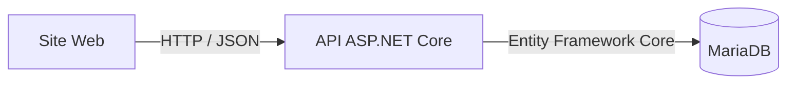
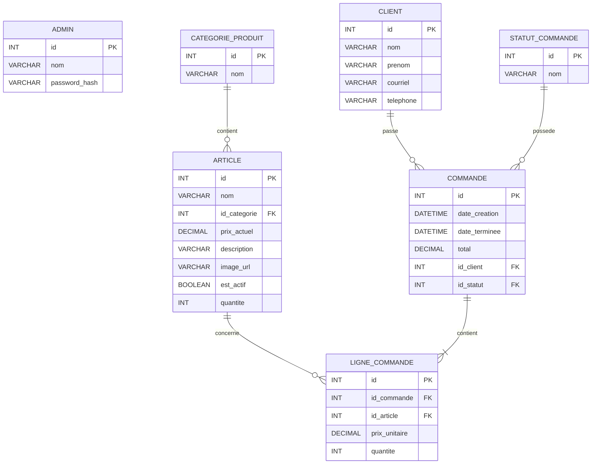
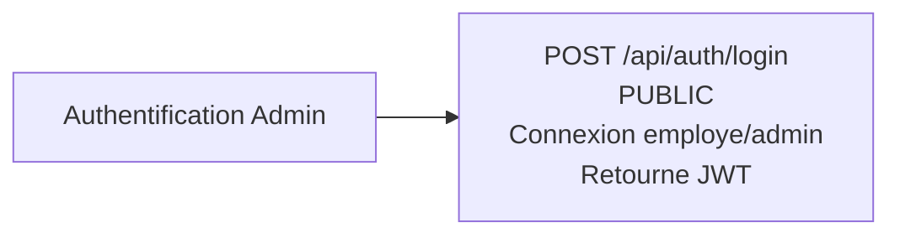
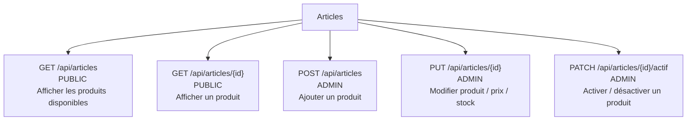
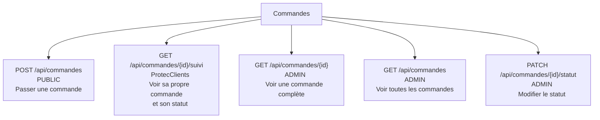
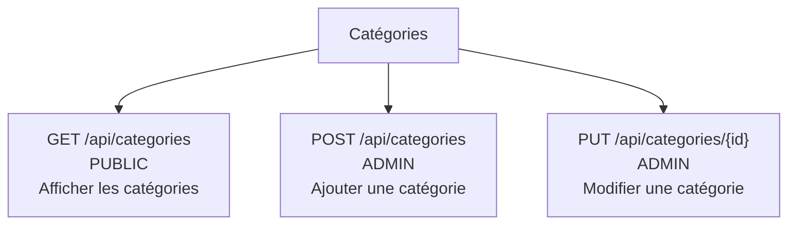
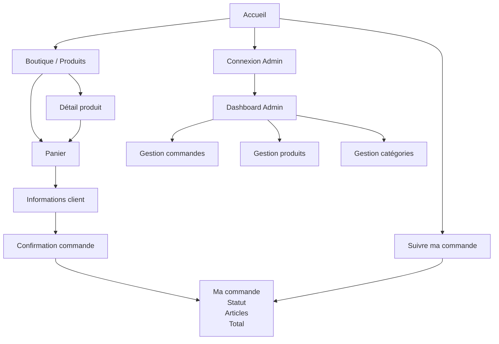

# Architecture du projet

Le projet est composé de trois parties principales :

- **Site Web** : interface utilisée par les clients et les administrateurs.
- **API ASP.NET Core** : fait le lien entre le site Web et la base de données.
- **MariaDB** : contient les produits, clients, commandes et autres données.



---

# Base de données

La base de données MariaDB contient les informations nécessaires au fonctionnement de la boutique.



---

# API

L'API ASP.NET Core permet au site Web de communiquer avec la base de données.

Les endpoints sont séparés selon leur niveau de sécurité :

- **PUBLIC** : accessible sans authentification.
- **ADMIN** : nécessite un JWT administrateur.
- **ProtecClients** : accès protégé aux informations d'une commande client.

## Authentification



## Articles



## Commandes

Les clients peuvent passer une commande et ensuite consulter **leur propre commande** pour voir son statut.

Les administrateurs peuvent consulter toutes les commandes et modifier leur statut.



> **ProtecClients** doit vérifier que le client a le droit de consulter cette commande. Le simple fait de connaître l'ID d'une commande ne doit pas permettre de voir les informations d'un autre client.

## Catégories



---

# Navigation du site Web

Le site Web possède une partie publique pour commander et suivre une commande ainsi qu'une partie réservée aux administrateurs.



---

# Structure générale

```text
Client
  │
  ▼
Site Web
  │
  │ HTTP / JSON
  ▼
API ASP.NET Core
  │
  │ Entity Framework Core
  │ Database First / Scaffold
  ▼
MariaDB
```

Le client peut commander sans accéder à l'administration. Après sa commande, il peut utiliser la fonction **Suivre ma commande** afin de consulter uniquement sa propre commande.

L'administrateur doit s'authentifier avec un **JWT** pour gérer les produits, les catégories et les commandes.

_____________
